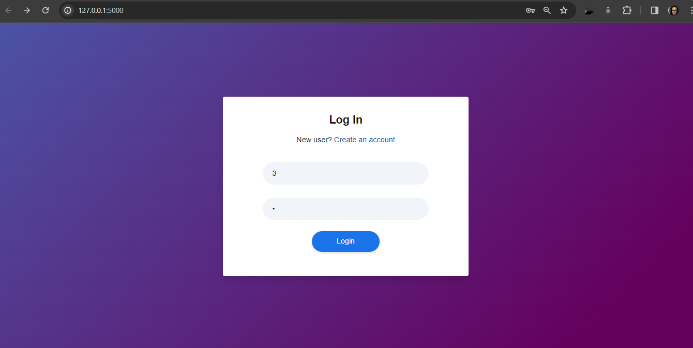
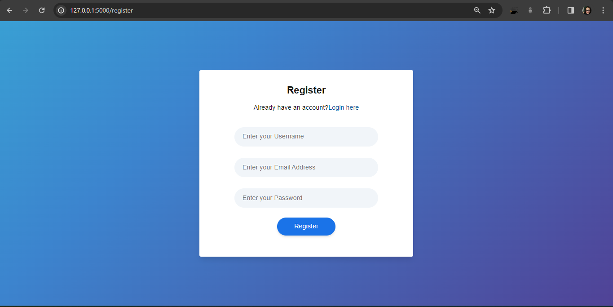
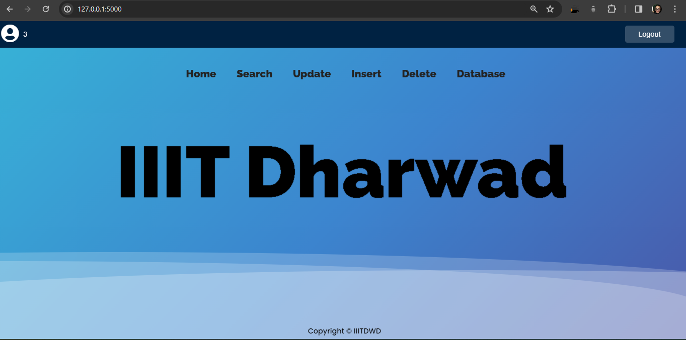
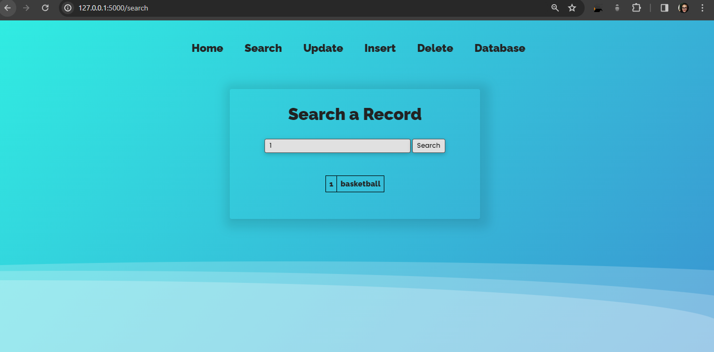
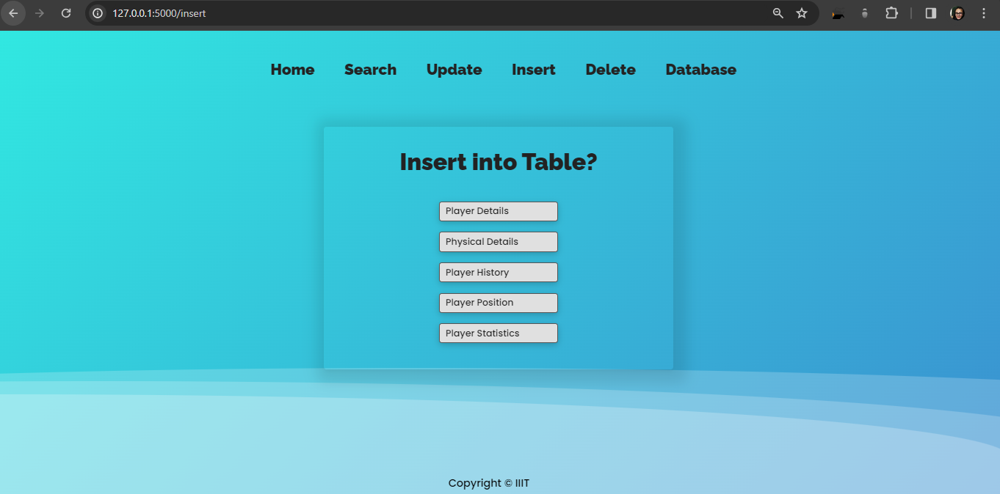
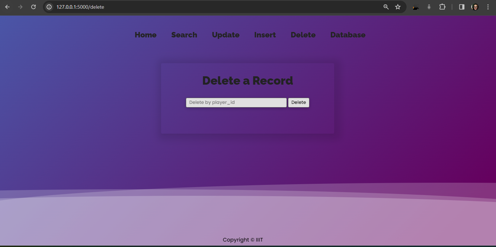
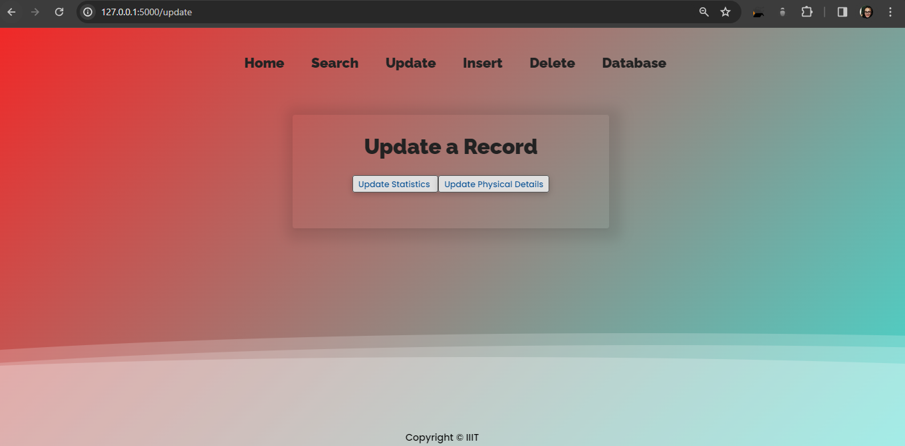
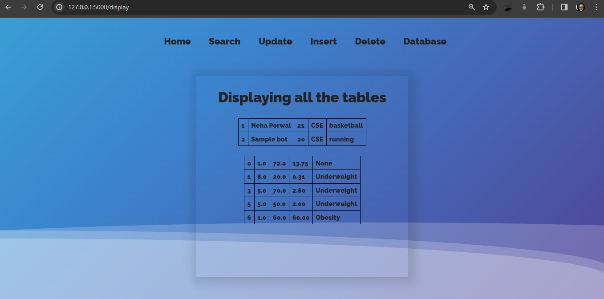

# Player Management System

The **Player Management System** is a comprehensive CRUD based web application designed to efficiently manage and organize the database of university players. This powerful system provides students and teachers with a seamless interface, allowing them to interact with and manipulate player data effectively.

The motivation behind creating the **Player Management System** was to address the challenges associated with managing player information in a university setting. The need for a centralized system that allows easy access, updating, and retrieval of player data inspired the development of this application.
It has tables like player physical details, history, position, statistics like running speed etc. so that if we want to select players for a particular sports event then we can choose them wisely considering all these factors. We can search for players from their player Id and sport they play. With the use of MYsql triggers it calculates overall rating and BMI of the players. Based on the BMI it has a function which assigns categories to players like Underweight, Normal or Overweight. All these features make it a perfect application for managing players in our university.
## Features

### Login/Signup
Users can log in or sign up to access personalized dashboards, creating a user-centric experience. The dashboard displays a profile icon and username for a personalized touch.

### Search
The system allows users to search for players using player ID or name. Detailed search results display relevant information about the player, including the games they play.

### Insert
Users can insert new records into the database, covering various aspects such as Player Details, Physical Details, Player History, Player Position, and Player Statistics.

### Delete
Players' records can be deleted by specifying the player ID, providing a convenient way to remove outdated or unnecessary information.

### Update
The system enables users to update existing records, including player statistics and physical details.

### Display
Users can view all tables containing player information, offering a comprehensive overview of the stored data.

## Benefits

The **Player Management System** brings several benefits to the table:

- **Efficient Data Organization:** The system facilitates the efficient organization of player data, making it easy to manage and retrieve information.

- **Personalized Dashboards:** Users enjoy personalized dashboards, allowing quick access to relevant information.

- **BMI Calculation:** The system utilizes MySQL triggers for automatic BMI calculation based on player physical details.

- **Status Assignment:** A new column, "Status," categorizes players as Underweight, Normal, or Overweight based on their BMI.

## Future Scope

The **Player Management System** has a promising future with potential enhancements and expansions:

- **User Authentication Enhancements:** Implement additional authentication features to enhance security.

- **Advanced Search Options:** Expand search functionality to include more advanced filtering options.

- **Integration with External Systems:** Explore possibilities of integrating with external systems for broader data exchange.

- **Enhanced Reporting:** Implement advanced reporting features to generate insights from player data.
- Separate login and Signup for teachers and students with different data accessibility rights to them.
- Players can register themselves for any ongoing sports event in the college without having to approach the particular faculty.

## How to Run

1. Clone the repository.
2. Set up a virtual environment and install dependencies.
3. Configure the database connection.
4. Run the application using `python app.py`.
5. Access the application through your web browser at 'http://127.0.0.1:5000'.

